# <p align="center">DOTFILES</p>

## Contents

- [Rice](#my-nord-rice)
- [Details](#details)
- [How To Copy](#how-to-copy)
- [Screenshots](#screenshots)

## My Nord Rice

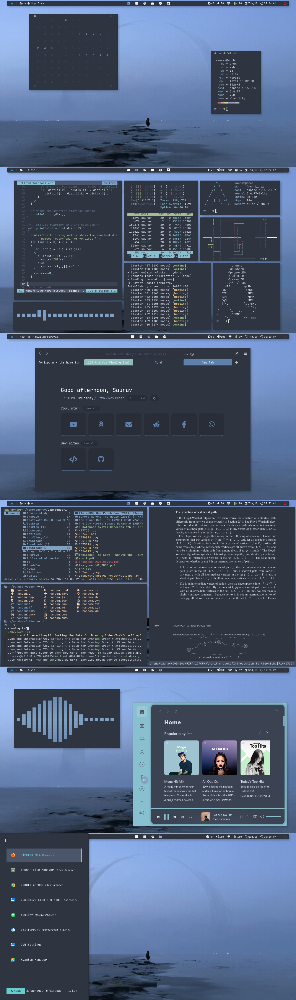

This is my first rice and first Arch install with a window manager (i3-gaps).
This rice is not made for aesthetics. But I like gaps that is why I have less gaps in the rice so that I can be more productive in my laptop.
It took 2 weeks to learn about all of the different packages and how to rice in general.
The files are messy and I will clean it later, also I will add more things as I learn more about linux and all other things.
This repo is made so that I can copy this in different system and I want to post this in r/unixporn.

## Details

- **OS** : [Arch](https://wiki.archlinux.org/index.php/Installation_guide)(btw)
- **WM** : [i3-gaps](https://github.com/Airblader/i3)
- **BAR** : [Polybar](https://github.com/polybar/polybar)
- **TERMINAL** : [Alacritty](https://github.com/alacritty/alacritty)
- **SHELL** : Zsh
  - **Plugins** :
    - [Powerlevel10k](https://github.com/romkatv/powerlevel10k)
    - [Colorls](https://github.com/athityakumar/colorls)
    - [Zsh-syntax-highlighting](https://github.com/zsh-users/zsh-syntax-highlighting)
    - [Zsh-autosuggestions](https://github.com/zsh-users/zsh-autosuggestions)
    - [Zsh-autocomplete](https://github.com/marlonrichert/zsh-autocomplete)
    - [FZF](https://github.com/junegunn/fzf)
- **EDITOR** : [Neovim](https://github.com/neovim/neovim)
  - **Plugins** :
    - [vim-polyglot](https://github.com/sheerun/vim-polyglot)
    - [jiangmiao/auto-pairs](https://github.com/jiangmiao/auto-pairs)
    - [vim-airline/vim-airline](https://github.com/vim-airline/vim-airline)
    - [vim-airline/vim-airline-themes](https://github.com/vim-airline/vim-airline-themes)
    - [arcticicestudio/nord-vim](https://github.com/arcticicestudio/nord-vim)
    - [neoclide/coc.nvim](https://github.com/neoclide/coc.nvim)
      - **Coc Extensions** :
        - [coc-yank](https://github.com/neoclide/coc-yank)
        - [coc-prettier](https://github.com/neoclide/coc-prettier)
        - [coc-explorer](https://github.com/weirongxu/coc-explorer)
        - [coc-snippets](https://github.com/neoclide/coc-snippets)
        - [coc-vimlsp](https://github.com/iamcco/coc-vimlsp)
        - [coc-json](https://github.com/neoclide/coc-json)
        - [coc-markdownlint](https://github.com/fannheyward/coc-markdownlint)
        - [coc-python](https://github.com/neoclide/coc-python)
        - [coc-sql](https://github.com/fannheyward/coc-sql)
        - [coc-tsserver](https://github.com/neoclide/coc-tsserver)
        - [coc-clangd](https://github.com/clangd/coc-clangd)
        - [coc-sh](https://github.com/josa42/coc-sh)
    - [kevinhwang91/rnvimr](https://github.com/kevinhwang91/rnvimr)
    - [junegunn/fzf](https://github.com/junegunn/fzf.vim)
    - [airblade/vim-rooter](https://github.com/airblade/vim-rooter)
    - [norcalli/nvim-colorizer.lua](https://github.com/norcalli/nvim-colorizer.lua)
    - [junegunn/rainbow_parentheses.vim](https://github.com/junegunn/rainbow_parentheses.vim)
    - [mhinz/vim-startify](https://github.com/mhinz/vim-startify)
    - [mhinz/vim-signify](https://github.com/mhinz/vim-signify)
    - [tpope/vim-fugitive](https://github.com/tpope/vim-fugitive)
    - [tpope/vim-rhubarb](https://github.com/tpope/vim-rhubarb)
    - [junegunn/gv.vim](https://github.com/junegunn/gv.vim)
    - [justinmk/vim-sneak](https://github.com/justinmk/vim-sneak)
    - [unblevable/quick-scope](https://github.com/unblevable/quick-scope)
    - [honza/vim-snippets](https://github.com/honza/vim-snippets)
    - [tpope/vim-commentary](https://github.com/tpope/vim-commentary)
    - [psliwka/vim-smoothie](https://github.com/psliwka/vim-smoothie)
    - [iamcco/markdown-preview.nvim](https://github.com/iamcco/markdown-preview.nvim)
- **FONT** : [JetBrainsMono Nerd Font](https://github.com/ryanoasis/nerd-fonts/tree/master/patched-fonts/JetBrainsMono)
- **WALLPAPER** : [From wallhaven](https://whvn.cc/p8drxp)
- **MUSIC PLAYER** : Spotify (with [Spicetify](https://github.com/khanhas/spicetify-cli) and [Dribbblish Nord Dark Theme](https://github.com/morpheusthewhite/spicetify-themes/wiki/Themes-preview#nord-dark) from [spicetify-themes](https://github.com/morpheusthewhite/spicetify-themes))
- **BROWSER** : Firefox ([userChrome](https://github.com/mut-ex/minimal-functional-fox)-with some modification,[startpage](https://addons.mozilla.org/en-US/firefox/addon/nighttab/))
- **SEARCH ENGINE** : DuckDuckGo (with custom color theme you can have the same by loading the setting, code - HashtagNord)
- **FILE MANAGER** : [Ranger](https://github.com/ranger/ranger)
- **NOTIFICATION** : [Dunst](https://github.com/dunst-project/dunst)
- **COMPOSITOR** : [Picom-ibhagwan](https://github.com/ibhagwan/picom)
- **GTK THEME** : [Nordic](https://www.gnome-look.org/p/1267246/)
- **ICONS** : [Papirus](https://github.com/PapirusDevelopmentTeam/papirus-icon-theme)
- **CURSOR** : [Volantes](https://store.kde.org/p/1356095/)
- **VIDEO PLAYER** : [Mpv](https://github.com/mpv-player/mpv)
- **SYSTEM MONITOR** : [Htop](https://htop.dev/downloads.html)
- **SCREEN CAPTURE** : [Scrot](https://github.com/resurrecting-open-source-projects/scrot)
- **IMAGE VIEWER** : [Feh](https://github.com/derf/feh)
- **DOCUMENT VIEWER** : [Zathura](https://github.com/pwmt/zathura)
- **APP LAUNCHER** : [Rofi](https://github.com/davatorium/rofi)
- **DISPLAY MANAGER** : [LightDM](https://github.com/canonical/lightdm) ([with Litarvan theme](https://github.com/Litarvan/lightdm-webkit-theme-litarvan))
- **LOCK SCREEN** : [Betterlockscreen](https://github.com/pavanjadhaw/betterlockscreen)

## How To Copy

- I would suggest **not to copy everything directly**, because each system is different in many aspects (I have tried directly copying other rices many times and it didn't worked out).
- **The Best Way :**
  - Install all the dependencies or only those one which you like.
  - Go through the dotfiles one by one and modify to your liking.
  - Then build your own config.
- **The Other Way :**

  - **These commands below are not tested. You can use your prefered way.**
  - Make sure you have all the dependencies installed in your system (~~All~~ Most of it is mentioned above in the Details section).
  - Then git clone this repository in your system. This command will clone this repo to your downloads folder (make sure you have git installed).

    ```bash
    git clone https://github.com/hashtagsaurav/dotfiles.git ~/Downloads
    ```

  - Then copy the config files. I would suggest **not copy the files directly** rathar you should go through the whole config files and then try to copy. This command will copy the files.

    ```bash
      cd ~/Downloads/dotfiles
      cp -r .config ~/.config
      cp .zshrc ~
      cp .p10k.zsh ~
    ```

  - Then reboot the system.

## Screenshots

- Polybar and Wallpaper

  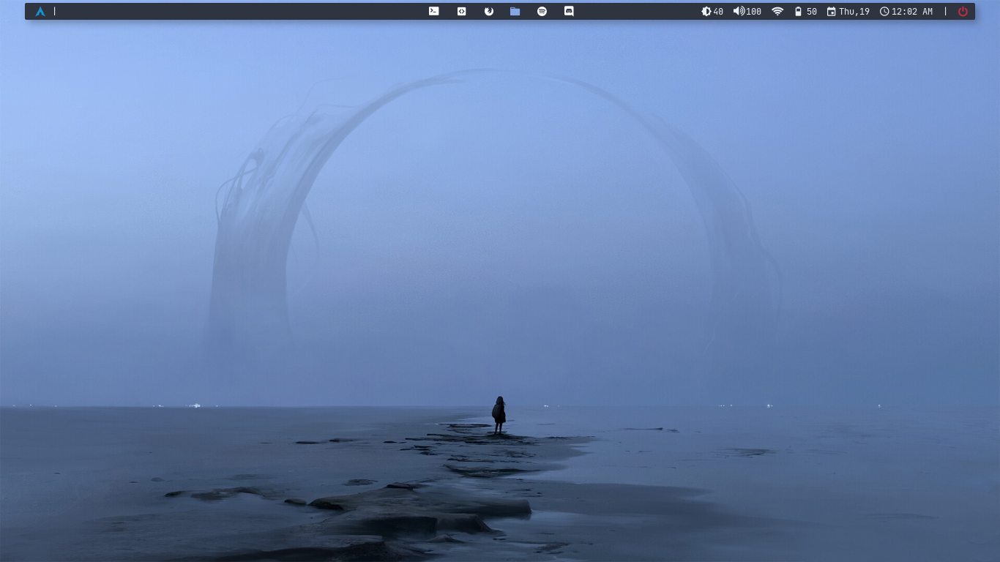

- Neofetch and Dunst

  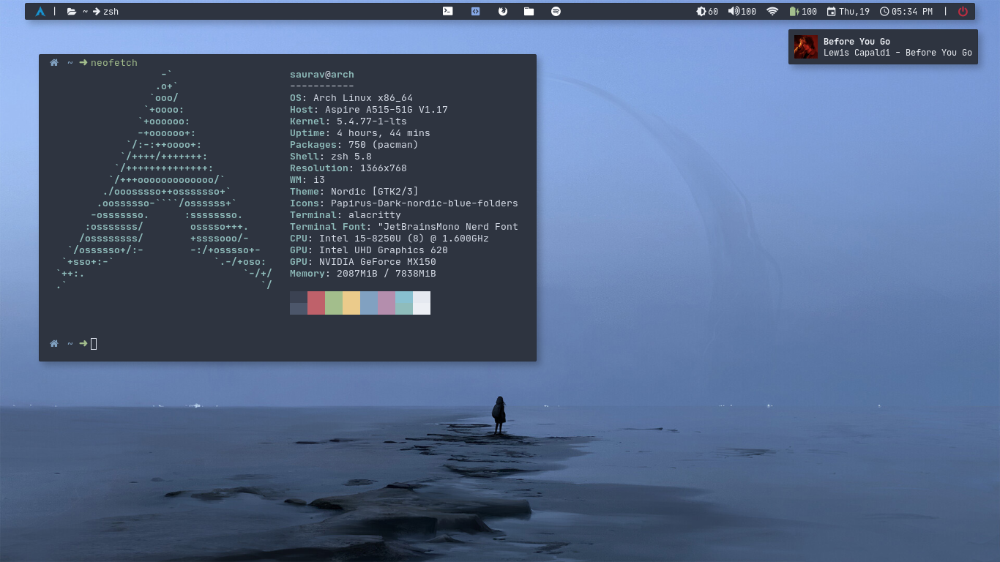

- Firefox

  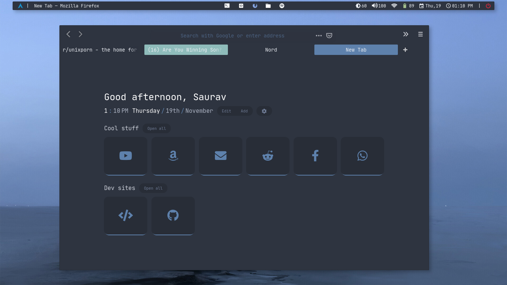

- Neovim

  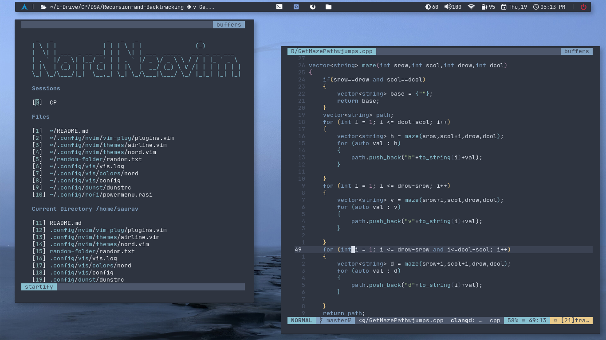

- Feh, Ranger and Alacritty

  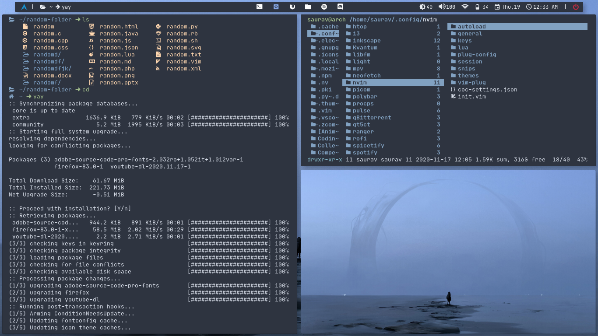

- Rofi

  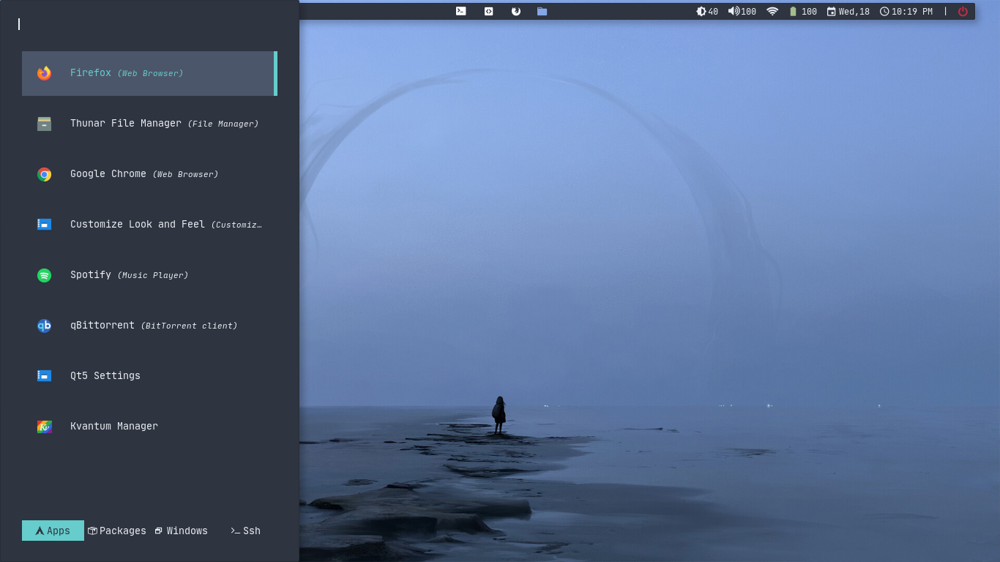

- Powermenu - rofi script

  

- DuckDuckGo (Yeah, I switched)

  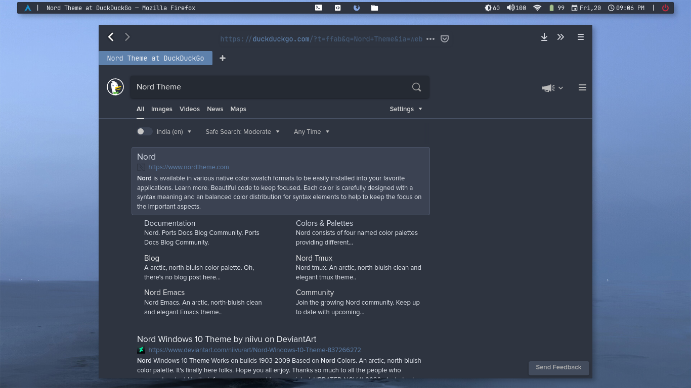

- Mpv and workflow

  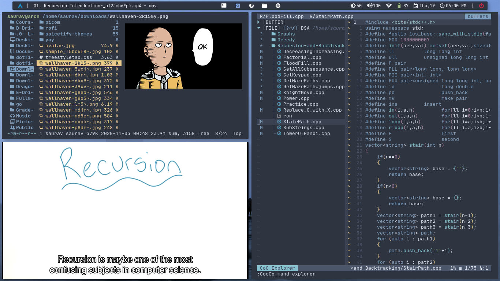

- Ranger, Zathura, Colorls and Fzf

  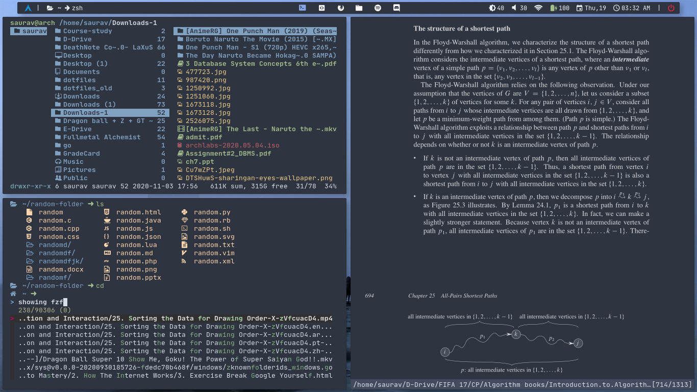

- Zathura and Neovim

  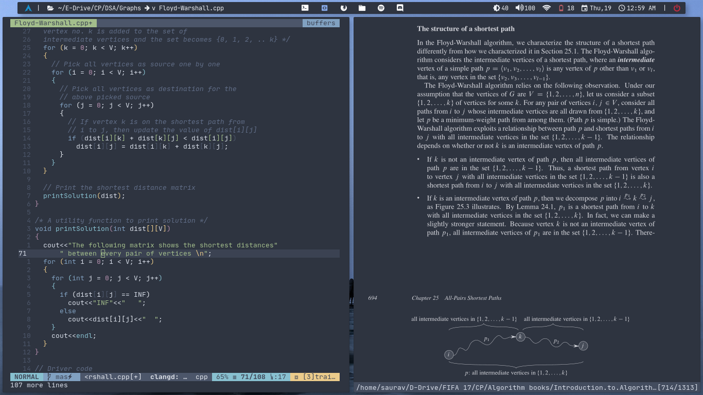

- Betterlockscreen

  

- Spotify

  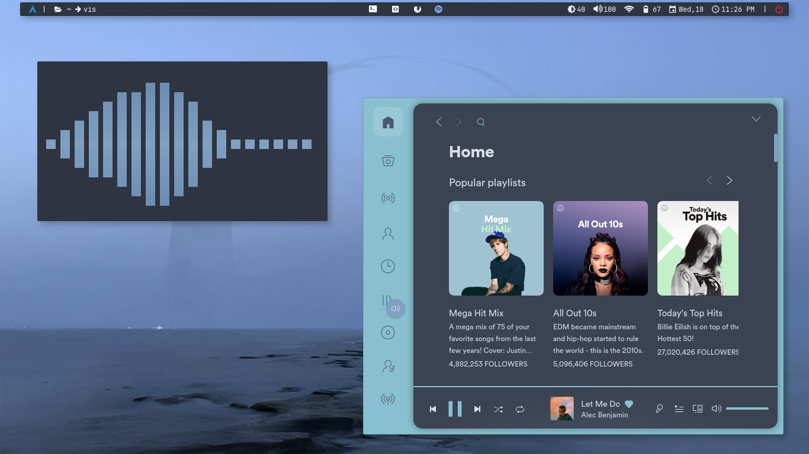

- For unixporn

  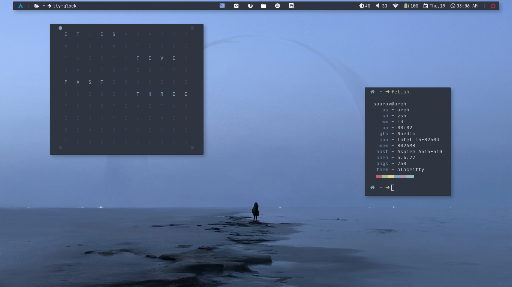

  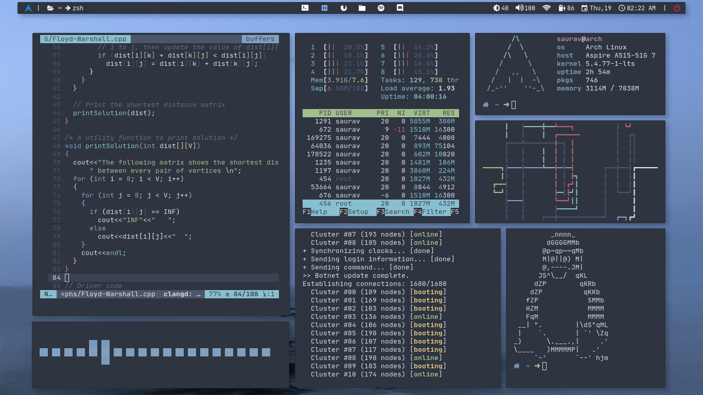
